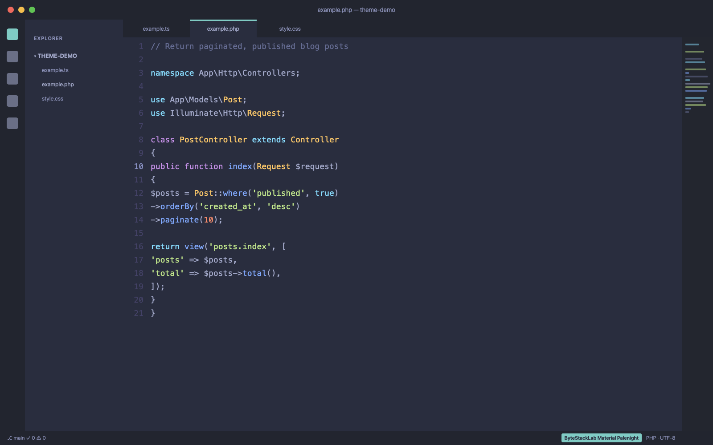
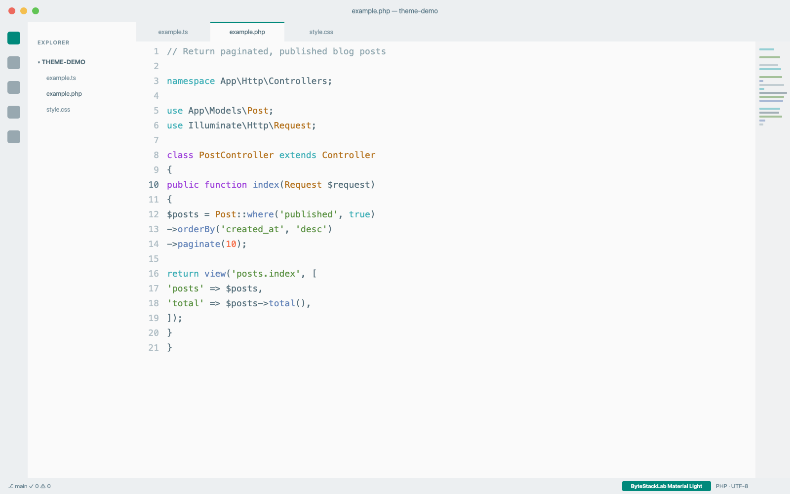

# ByteStackLab Material Theme

Material-inspired themes for VS Code, crafted by ByteStackLab. Optimized for PHP, Laravel Blade, Vue, and JavaScript/TypeScript — with semantic highlighting for sharper type-aware syntax colors.

## Variants

### ByteStackLab Material Dark

A warm, classic Material dark look — `#212121` editor background with a teal accent.


### ByteStackLab Material Ocean

A deep blue-black variant — `#0F111A` editor background with a teal accent.


### ByteStackLab Material Palenight

A purple-tinted dark variant — `#292D3E` editor background with the same accent palette.



### ByteStackLab Material Light

A clean light variant — `#FAFAFA` editor background with the same Material palette.



## Installation

1. Open Extensions (`Ctrl+Shift+X` / `Cmd+Shift+X`)
2. Search **"ByteStackLab Material Theme"**
3. Install → `Ctrl+K Ctrl+T` (`Cmd+K Cmd+T`) → pick a variant

## Recommended Settings

```json
{
  "editor.fontFamily": "'JetBrains Mono', 'Fira Code', monospace",
  "editor.fontLigatures": true
}
```

## Credits

Color schemes derived from [Material Theme](https://github.com/material-theme) v33.11.0
(Apache-2.0) by Mattia Astorino and contributors — see [THIRD-PARTY-NOTICES.md](THIRD-PARTY-NOTICES.md).
Maintained by [Mokammel Tanvir](https://mokammeltanvir.com) · [ByteStackLab](https://bytestacklab.com)

## License

[MIT](LICENSE)
