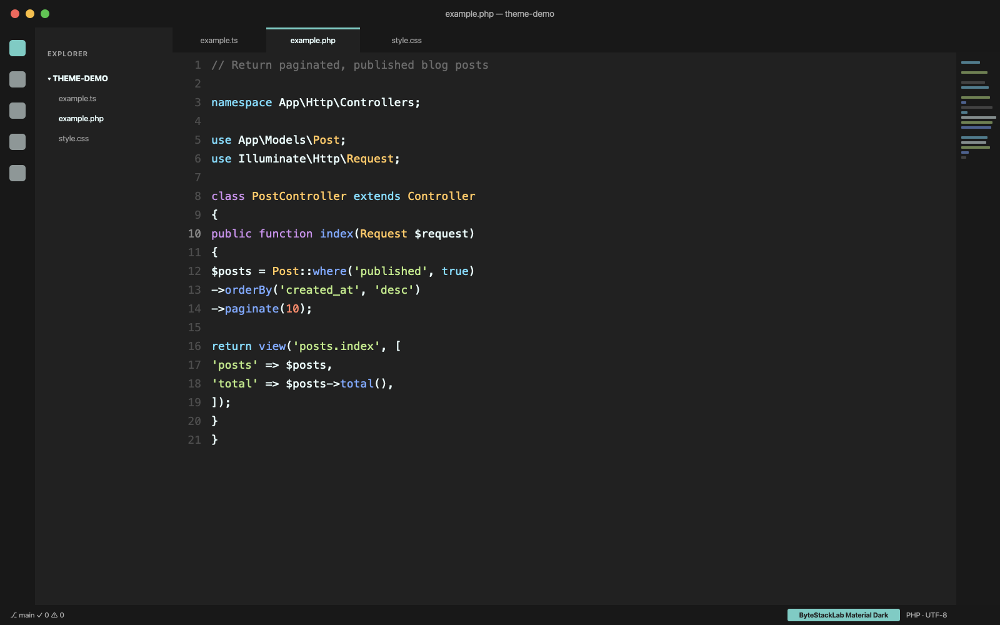
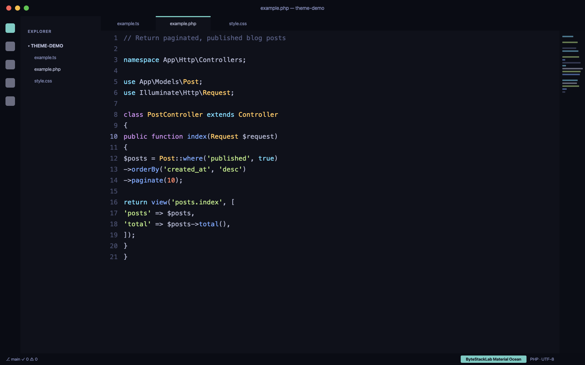

# ByteStack Material — VS Code Theme Build & Publish Guide

> **Publisher:** ByteStackLab
> **Variants:** ByteStack Material Dark + ByteStack Material Ocean
> **Author:** Mokammel Tanvir (mokammeltanvir.com)

---

## Table of Contents

1. [Prerequisites](#1-prerequisites)
2. [Project Setup](#2-project-setup)
3. [Folder Structure](#3-folder-structure)
4. [package.json Configuration](#4-packagejson-configuration)
5. [Theme Files (Dark + Ocean)](#5-theme-files-dark--ocean)
6. [Local Testing (Publish ছাড়াই)](#6-local-testing)
7. [Icon, README & Marketplace Assets](#7-icon-readme--marketplace-assets)
8. [Publisher Account Setup](#8-publisher-account-setup)
9. [Publishing](#9-publishing)
10. [Update / New Version Release](#10-update--new-version-release)
11. [Pre-publish Checklist](#11-pre-publish-checklist)

---

## 1. Prerequisites

- **Node.js** (LTS version — v18+)
- **VS Code** (latest)
- **Git** + GitHub account
- Microsoft account (publisher এর জন্য)

Global packages install করুন:

```bash
npm install -g yo generator-code @vscode/vsce
```

| Package | কাজ |
|---|---|
| `yo` + `generator-code` | Theme project scaffold করে |
| `@vscode/vsce` | Package (.vsix) বানায় ও publish করে |

---

## 2. Project Setup

```bash
yo code
```

Generator এ এই অপশনগুলো দিন:

```
? What type of extension?        → New Color Theme
? Start fresh or import?         → No, start fresh
? Extension name?                → ByteStack Material
? Identifier?                    → bytestack-material
? Description?                   → Material-inspired dark themes by ByteStackLab
? Theme name?                    → ByteStack Material Dark
? Base theme?                    → Dark
```

> **Note:** Generator একটাই theme বানায়। Ocean variant টা আমরা manually add করবো (Section 5)।

```bash
cd bytestack-material
code .
```

---

## 3. Folder Structure

Final structure এমন হবে:

```
bytestack-material/
├── .vscode/
│   └── launch.json
├── themes/
│   ├── bytestack-material-dark-color-theme.json
│   └── bytestack-material-ocean-color-theme.json
├── images/
│   ├── icon.png              (128x128)
│   ├── screenshot-dark.png
│   └── screenshot-ocean.png
├── package.json
├── README.md
├── CHANGELOG.md
├── LICENSE
└── .vscodeignore
```

---

## 4. package.json Configuration

```json
{
  "name": "bytestack-material",
  "displayName": "ByteStack Material",
  "description": "Material-inspired dark themes for VS Code — Dark & Ocean variants. By ByteStackLab.",
  "version": "1.0.0",
  "publisher": "bytestacklab",
  "license": "MIT",
  "icon": "images/icon.png",
  "engines": {
    "vscode": "^1.75.0"
  },
  "categories": ["Themes"],
  "keywords": [
    "material",
    "material theme",
    "dark theme",
    "ocean",
    "bytestack"
  ],
  "galleryBanner": {
    "color": "#0F111A",
    "theme": "dark"
  },
  "repository": {
    "type": "git",
    "url": "https://github.com/bytestacklab/bytestack-material"
  },
  "homepage": "https://bytestacklab.com",
  "bugs": {
    "url": "https://github.com/bytestacklab/bytestack-material/issues"
  },
  "contributes": {
    "themes": [
      {
        "label": "ByteStack Material Dark",
        "uiTheme": "vs-dark",
        "path": "./themes/bytestack-material-dark-color-theme.json"
      },
      {
        "label": "ByteStack Material Ocean",
        "uiTheme": "vs-dark",
        "path": "./themes/bytestack-material-ocean-color-theme.json"
      }
    ]
  }
}
```

**Key points:**

- `publisher` অবশ্যই আপনার marketplace publisher ID এর সাথে exactly match করতে হবে
- `keywords` এ "material theme" রাখলে search এ ভালো rank পাবেন
- `galleryBanner.color` — marketplace page এর header color

---

## 5. Theme Files (Dark + Ocean)

### Color Palette Reference

Material-inspired দুইটা variant এর জন্য base palette:

**ByteStack Material Dark:**

| Element | Color |
|---|---|
| Editor background | `#212121` |
| Sidebar background | `#1B1B1B` |
| Foreground text | `#EEFFFF` |
| Comments | `#546E7A` |
| Keywords | `#C792EA` |
| Strings | `#C3E88D` |
| Functions | `#82AAFF` |
| Numbers | `#F78C6C` |
| Variables | `#EEFFFF` |
| Tags (HTML/Blade) | `#F07178` |
| Accent | `#80CBC4` |

**ByteStack Material Ocean:**

| Element | Color |
|---|---|
| Editor background | `#0F111A` |
| Sidebar background | `#090B10` |
| Foreground text | `#BABED8` |
| Comments | `#464B5D` |
| Keywords | `#C792EA` |
| Strings | `#C3E88D` |
| Functions | `#82AAFF` |
| Numbers | `#F78C6C` |
| Variables | `#EEFFFF` |
| Tags (HTML/Blade) | `#F07178` |
| Accent | `#84FFFF` |

### Theme JSON Structure

প্রতিটা theme file এর মূল কাঠামো:

```json
{
  "name": "ByteStack Material Ocean",
  "type": "dark",
  "colors": {
    "editor.background": "#0F111A",
    "editor.foreground": "#BABED8",
    "sideBar.background": "#090B10",
    "sideBar.foreground": "#4B526D",
    "activityBar.background": "#090B10",
    "statusBar.background": "#090B10",
    "titleBar.activeBackground": "#0F111A",
    "tab.activeBackground": "#0F111A",
    "tab.inactiveBackground": "#090B10",
    "editorGroupHeader.tabsBackground": "#090B10",
    "editorLineNumber.foreground": "#3B3F51",
    "editorCursor.foreground": "#FFCC00",
    "editor.selectionBackground": "#1F2233",
    "editor.lineHighlightBackground": "#00000030",
    "panel.background": "#090B10",
    "terminal.background": "#090B10",
    "input.background": "#1A1C25",
    "dropdown.background": "#1A1C25",
    "list.activeSelectionBackground": "#1F2233",
    "list.hoverBackground": "#1A1C25",
    "badge.background": "#84FFFF",
    "badge.foreground": "#0F111A",
    "button.background": "#84FFFF",
    "button.foreground": "#0F111A",
    "scrollbarSlider.background": "#84FFFF20"
  },
  "tokenColors": [
    {
      "name": "Comments",
      "scope": ["comment", "punctuation.definition.comment"],
      "settings": { "foreground": "#464B5D", "fontStyle": "italic" }
    },
    {
      "name": "Keywords",
      "scope": ["keyword", "storage.type", "storage.modifier"],
      "settings": { "foreground": "#C792EA" }
    },
    {
      "name": "Strings",
      "scope": ["string", "punctuation.definition.string"],
      "settings": { "foreground": "#C3E88D" }
    },
    {
      "name": "Functions",
      "scope": ["entity.name.function", "support.function"],
      "settings": { "foreground": "#82AAFF" }
    },
    {
      "name": "Numbers & Constants",
      "scope": ["constant.numeric", "constant.language"],
      "settings": { "foreground": "#F78C6C" }
    },
    {
      "name": "Classes",
      "scope": ["entity.name.class", "entity.name.type", "support.class"],
      "settings": { "foreground": "#FFCB6B" }
    },
    {
      "name": "Variables",
      "scope": ["variable", "variable.other.php"],
      "settings": { "foreground": "#EEFFFF" }
    },
    {
      "name": "HTML/Blade Tags",
      "scope": ["entity.name.tag"],
      "settings": { "foreground": "#F07178" }
    },
    {
      "name": "Tag Attributes",
      "scope": ["entity.other.attribute-name"],
      "settings": { "foreground": "#C792EA", "fontStyle": "italic" }
    },
    {
      "name": "PHP Variables ($)",
      "scope": ["punctuation.definition.variable.php"],
      "settings": { "foreground": "#89DDFF" }
    },
    {
      "name": "Operators & Punctuation",
      "scope": ["keyword.operator", "punctuation"],
      "settings": { "foreground": "#89DDFF" }
    }
  ]
}
```

> **Dark variant এর জন্য:** একই structure, শুধু background/UI colors গুলো Dark palette অনুযায়ী বদলাবেন। Token colors দুই variant এ প্রায় same থাকতে পারে।

### Laravel/Vue Developer দের জন্য Extra Scope গুলো

আপনার নিজের stack (Laravel + Vue) দিয়ে test করার সময় এই scope গুলো দেখবেন:

```json
{
  "name": "Blade Directives (@if, @foreach)",
  "scope": ["keyword.blade", "support.function.blade"],
  "settings": { "foreground": "#C792EA" }
},
{
  "name": "Vue Directives (v-if, v-for, :prop)",
  "scope": ["entity.other.attribute-name.html.vue"],
  "settings": { "foreground": "#C792EA", "fontStyle": "italic" }
}
```

### Scope খুঁজে বের করার Trick

কোনো token এর রং ঠিক না লাগলে:

1. `Ctrl+Shift+P` (Mac: `Cmd+Shift+P`)
2. **"Developer: Inspect Editor Tokens and Scopes"**
3. Code এর যেকোনো জায়গায় click করুন → সেই token এর scope list দেখাবে
4. ওই scope টা `tokenColors` এ add করে রং দিন

---

## 6. Local Testing

### পদ্ধতি ১: F5 — Extension Development Host (Development এর সময়)

1. Theme project টা VS Code এ খুলুন
2. `F5` চাপুন
3. নতুন একটা **[Extension Development Host]** window খুলবে
4. সেখানে `Ctrl+K Ctrl+T` চেপে **ByteStack Material Dark / Ocean** সিলেক্ট করুন
5. JSON এ কোনো change করলে development host window তে **auto reload** হয়

**Test করার জন্য এই ফাইলগুলো খুলুন:**

- একটা Laravel Controller (`.php`)
- একটা Blade template (`.blade.php`)
- একটা Vue component (`.vue`)
- `package.json` / `composer.json`
- একটা `.js` / `.ts` ফাইল
- Markdown ফাইল
- Terminal + Search panel + Settings UI ও দেখুন

### পদ্ধতি ২: .vsix Package বানিয়ে Real Install (Publish এর আগে Final Test)

এটাই আসল উত্তর আপনার প্রশ্নের — **publish না করেই** marketplace-এর মতো install করে test করা যায়:

```bash
cd bytestack-material
vsce package
```

এটা একটা file বানাবে: `bytestack-material-1.0.0.vsix`

**Install করার ২টা উপায়:**

```bash
# Command line থেকে:
code --install-extension bytestack-material-1.0.0.vsix
```

অথবা VS Code UI থেকে:
1. Extensions panel (`Ctrl+Shift+X`)
2. উপরে `...` (More Actions) → **Install from VSIX...**
3. `.vsix` file টা সিলেক্ট করুন

এখন এটা আপনার VS Code এ **installed extension** হিসেবে থাকবে — exactly যেভাবে marketplace থেকে install হতো। কয়েকদিন daily কাজে ব্যবহার করে দেখুন, তারপর publish করুন।

> **Bonus:** `.vsix` file টা বন্ধু/colleague দের পাঠিয়ে তাদের machine এও test করাতে পারবেন।

**Uninstall করতে:** Extensions panel → ByteStack Material → Uninstall

### Common Issues

| সমস্যা | সমাধান |
|---|---|
| `vsce package` fail: "Make sure to edit README" | Generator এর default README টা বদলাননি — নিজের content লিখুন |
| Theme dropdown এ দেখাচ্ছে না | `package.json` এর `contributes.themes[].path` ঠিক আছে কিনা দেখুন |
| কিছু token রং পাচ্ছে না | Inspect Tokens দিয়ে scope বের করে add করুন |
| SVG icon reject | Icon অবশ্যই PNG হতে হবে, SVG allowed না |

---

## 7. Icon, README & Marketplace Assets

### Icon

- **128x128 PNG** (SVG চলবে না)
- ByteStackLab branding এর সাথে মিলিয়ে বানান
- `package.json` এ: `"icon": "images/icon.png"`

### README.md (এটাই আপনার Marketplace Page!)

Structure:

```markdown
# ByteStack Material

Material-inspired dark themes for VS Code, crafted by ByteStackLab.

## Variants

### ByteStack Material Dark


### ByteStack Material Ocean


## Installation

1. Open Extensions (`Ctrl+Shift+X`)
2. Search "ByteStack Material"
3. Install → `Ctrl+K Ctrl+T` → pick a variant

## Recommended Settings

​```json
{
  "editor.fontFamily": "'JetBrains Mono', 'Fira Code', monospace",
  "editor.fontLigatures": true
}
​```

## Credits

Inspired by the Material design color philosophy.
Created by [Mokammel Tanvir](https://mokammeltanvir.com) · [ByteStackLab](https://bytestacklab.com)

## License

MIT
```

**Screenshot tips:**

- আপনার নিজের Laravel/Vue code দিয়ে screenshot নিন (real-world দেখায়)
- `Ctrl+Shift+P` → "Screencast Mode" off রাখুন, zoom 1-2 level বাড়িয়ে নিন
- GitHub এ push করার পর README এর image path গুলো কাজ করবে marketplace এ (raw GitHub URL ব্যবহার করাই safest)

### CHANGELOG.md

```markdown
# Changelog

## [1.0.0] - 2026-07-XX
- Initial release
- ByteStack Material Dark variant
- ByteStack Material Ocean variant
- Optimized for PHP, Blade, Vue, JavaScript
```

### .vscodeignore

Package size ছোট রাখতে:

```
.vscode/**
.git/**
*.vsix
node_modules/**
```

> **Note:** Screenshots README তে লাগে, তাই `images/` ignore করবেন না।

---

## 8. Publisher Account Setup

### Step 1: Azure DevOps Organization

1. https://dev.azure.com এ Microsoft account দিয়ে login
2. প্রথমবার হলে একটা organization create হবে (নাম যেকোনো কিছু)

### Step 2: Personal Access Token (PAT)

1. Azure DevOps → উপরে ডানে **User Settings** (icon) → **Personal Access Tokens**
2. **+ New Token**
3. Settings:
   - **Name:** `vsce-publish`
   - **Organization:** ⚠️ **All accessible organizations** (এটা ভুল হলে publish fail করবে!)
   - **Expiration:** Custom — ১ বছর
   - **Scopes:** Custom defined → **Marketplace** → ✅ **Manage**
4. **Create** → Token টা copy করে নিরাপদ জায়গায় রাখুন (আর দেখাবে না!)

### Step 3: Marketplace Publisher Create

1. https://marketplace.visualstudio.com/manage
2. **Create publisher**
3. Fill up:
   - **ID:** `bytestacklab` (⚠️ পরে বদলানো যায় না!)
   - **Name:** `ByteStackLab`
   - Logo, website (bytestacklab.com) দিন

---

## 9. Publishing

```bash
cd bytestack-material

# Login (PAT চাইবে)
vsce login bytestacklab

# Publish!
vsce publish
```

Success হলে কয়েক মিনিটের মধ্যে live হবে:

```
https://marketplace.visualstudio.com/items?itemName=bytestacklab.bytestack-material
```

Marketplace এ verification/scan এ কখনো কখনো ৫-১০ মিনিট লাগে। Status দেখতে: https://marketplace.visualstudio.com/manage

---

## 10. Update / New Version Release

Theme এ change করার পর:

```bash
# Patch version (1.0.0 → 1.0.1) — bug fix / ছোট color tweak
vsce publish patch

# Minor version (1.0.0 → 1.1.0) — নতুন variant / বড় feature
vsce publish minor
```

এগুলো automatically `package.json` এর version bump করে publish করে দেয়। `CHANGELOG.md` update করতে ভুলবেন না।

Users রা automatically update পেয়ে যাবে।

---

## 11. Pre-publish Checklist

- [ ] দুই variant ই `F5` দিয়ে test করা হয়েছে
- [ ] `.vsix` বানিয়ে real install করে **কমপক্ষে ২-৩ দিন daily ব্যবহার** করা হয়েছে
- [ ] PHP, Blade, Vue, JS, JSON, Markdown — সব ফাইলে syntax color ঠিক আছে
- [ ] Terminal, Search, Settings, Git diff view — UI সব জায়গায় দেখতে ভালো লাগছে
- [ ] `package.json`: publisher = `bytestacklab`, keywords, repository link ✓
- [ ] Icon 128x128 PNG ✓
- [ ] README এ দুই variant এর screenshot ✓
- [ ] CHANGELOG.md লেখা ✓
- [ ] LICENSE file (MIT) আছে ✓
- [ ] GitHub এ repo public করা + code push করা ✓
- [ ] PAT ready + publisher account created ✓

---

## Quick Command Reference

```bash
# Setup
npm install -g yo generator-code @vscode/vsce
yo code

# Test locally
# F5 in VS Code → Extension Development Host

# Package (publish ছাড়া test)
vsce package
code --install-extension bytestack-material-1.0.0.vsix

# Publish
vsce login bytestacklab
vsce publish

# Updates
vsce publish patch   # 1.0.0 → 1.0.1
vsce publish minor   # 1.0.0 → 1.1.0
```

---

*Guide prepared for ByteStackLab · July 2026*
